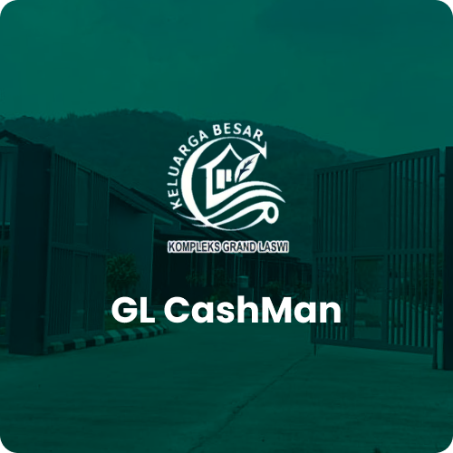

<p align="center">
  
</p>

# GL Manager App

GL Manager App adalah aplikasi yang diperuntukan bagi warga Grand Laswi untuk mempermudah rekap keuangan kas yang ada di komplek Grand Laswi.

## Getting Started

For help getting started with Flutter, view our online [documentation](https://flutter.io/).

- Flutter version : `3.19.4`
- Dart version : `3.3.2`
- You can read Dependency Version on `pubspec.lock`

## Run this Project

- If you useing IDE Visual Studio Code please open menu `Run and Debug` and select environment then click icon RUN.

**For Install or get packages :**

```BASH
flutter pub get
```

**For Run using command line plese run this :**

```BASH
flutter run
```

## Build APK

For build APK and share to testing team please run this command.

```BASH
flutter build apk --split-per-abi
```
